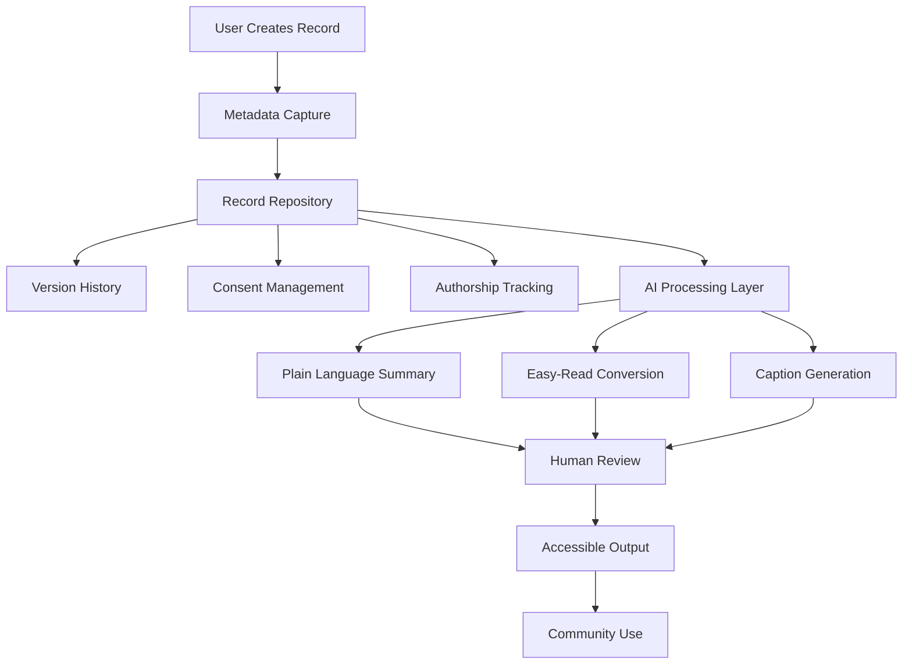

# Metadata Sovereignty AI Research Repository

Research repository supporting the **Metadata Sovereignty Alliance (EduLinked Pty Ltd)** project exploring ethical AI, authorship tracking, and accessibility-first metadata systems.

This repository is used by a student consulting team to investigate how artificial intelligence can responsibly support systems that preserve **authorship, consent, provenance, and accessible communication**.

Organisation: EduLinked Pty Ltd  
Location: Brisbane, Australia  
Contact: founder@edulinked.com.au  
Website: https://www.edulinked.com.au

## Start Here

New contributors should begin with these canonical orientation files:

- [NAVIGATION.md](NAVIGATION.md) - repository map and folder-level guide
- [STUDENT_RESEARCH_GUIDE.md](STUDENT_RESEARCH_GUIDE.md) - project context, research expectations, and contribution guidance
- [RESEARCH_QUESTIONS.md](RESEARCH_QUESTIONS.md) - research areas, outputs, and target folders
- [GLOSSARY.md](GLOSSARY.md) - shared terminology for metadata sovereignty, AI transparency, accessibility, and governance
- [METADATA_TEMPLATE.md](METADATA_TEMPLATE.md) - human-readable record documentation guidance
- [Machine-Operable Research System](docs/MACHINE_OPERABLE_RESEARCH_SYSTEM.md) - versioned contract, validator, authority boundaries, and implementation lifecycle

Use these files as the source of truth before adding or revising research content.

## Repository authority boundary

This repository is the **independently usable public research surface** for EduLinked Metadata Sovereignty. It does not own private product authority and must not be treated as an implementation mirror, integration client, operational gateway, or automatic projection of private product state.

The paired private boundary is `EduLinked-coder/metadata-sovereignty`. Its source-owned `repo.yaml` declares `role: private-product-authority` while `metadata.status: candidate`, and its README describes it as the **candidate private product-authority boundary**. Accordingly, this public repository must not describe that candidate boundary as already canonical or production-approved. The private repository contains the protected candidate product workspace for product architecture, product-level governance decisions, commercial hypotheses, private implementation knowledge, and policies governing derived-output generation and release; human approval remains required for canonical permission semantics, consent policy, AI-processing authority, production deployment, commercial commitments, and cross-visibility release.

The current product-roadmaps alignment is also `proposed` with `review_required: true`. Neither that portfolio projection nor the private repository role label independently proves final canonical product authority.

```yaml
productAuthorityBinding:
  publicResearchSurface:
    repository: EduLinked-Systems/metadata-sovereignty-ai-research
    role: independent-public-research-surface
  pairedPrivateBoundary:
    repository: EduLinked-coder/metadata-sovereignty
    declaredRole: private-product-authority
    lifecycleStatus: candidate
    canonicalProductAuthorityEstablished: false
  operationalDependencyAllowed: false
  automaticCrossVisibilitySyncAllowed: false
  sanitisedExportRequiresHumanReview: true
  sourceAuthorityTransfersOnCrossVisibilityRelease: false
  publicResearchMayImplyProductApproval: false
```

### Human-facing publication projection binding

The canonical human-facing publication surface for the research in this repository is the **public GitHub repository itself**. GitHub repository metadata currently reports `has_pages: true`, but no repository homepage is configured and the source-controlled workflow directory contains validation workflows only; no source-controlled Pages deployment workflow establishes a separate approved publication route.

```yaml
publicationProjectionBinding:
  sourceRepository: EduLinked-Systems/metadata-sovereignty-ai-research
  sourceRole: independent-public-research-surface
  canonicalHumanFacingProjection:
    type: github-repository
    url: https://github.com/EduLinked-Systems/metadata-sovereignty-ai-research
    status: active-public-research-surface
  githubPages:
    enabledInRepositoryMetadata: true
    configuredRepositoryHomepage: null
    sourceControlledDeploymentWorkflowPresent: false
    approvedPublicationDestinationEstablished: false
    canonicalPublicationAuthorityEstablished: false
    state: TECHNICAL_CONFIGURATION_PRESENT_PUBLICATION_ROUTE_UNRESOLVED
  publicationAuthority:
    mode: human-review-gated
    sourceAuthorityTransfersOnProjection: false
  invariants:
    githubPagesEnabledEqualsPublicationApproval: false
    technicalHostingEqualsCanonicalHumanProjection: false
    repositoryPublicEqualsPrivateProductRelease: false
    validationSuccessEqualsPublicationApproval: false
  continuation:
    requiredBeforePagesCanBeTreatedAsPublicationSurface:
      - attributable human publication decision naming the exact Pages destination and scope
      - source-owned deployment configuration or receipt proving the route
      - confirmation that the route does not transfer source or private product authority
```

This binding prevents machines or people from inferring a second canonical publication surface merely because GitHub Pages is enabled. Until the continuation evidence exists, Pages is technical repository configuration only; the public GitHub repository remains the evidenced human-facing research projection.

### Publication projection validation receipt — 2026-09-10

- **Canonical registry inspected:** `EduLinked-Systems/canonical-repository-ecosystem-registry` continues to classify this repository as `ACTIVE_RESEARCH_AND_PUBLICATION_WORKSPACE` / Metadata Sovereignty Public Research.
- **Source inspected:** this README at source head `09c106013c873ae557162620044bbed551e68791` before the binding change.
- **Repository publication configuration inspected:** GitHub repository metadata reports `visibility: public`, `has_pages: true`, and `homepage: null`.
- **Deployment-path check:** `.github/workflows/` contains validation workflows only (`validate-eso-04-research-public-canary.yml`, `validate-metadata-sovereignty.yml`, and `validate-minority-erasure.yml`); no source-controlled Pages deployment workflow was found.
- **What changed:** the existing public-research authority declaration now explicitly binds the public GitHub repository as the current human-facing research projection and classifies GitHub Pages as unresolved technical configuration rather than publication authority.
- **What did not change:** private product authority remains candidate and isolated; no product authority, release permission, publication approval, implementation authority, or cross-visibility synchronisation was inferred or transferred.
- **Remaining uncertainty:** the exact GitHub Pages source, URL, purpose, and any repository-setting-level deployment path are not proven by the inspected source evidence. Re-enter only when attributable publication evidence or source-owned deployment evidence establishes that route.

Preserve these boundaries:

`PUBLIC_RESEARCH_SURFACE != PRIVATE_PRODUCT_AUTHORITY`

`CANDIDATE_PRIVATE_PRODUCT_AUTHORITY != CANONICAL_PRODUCT_AUTHORITY`

`RESEARCH_CONCLUSION != PRODUCTION_POLICY`

`PUBLIC_REPOSITORY != PRIVATE_IMPLEMENTATION_MIRROR`

`PRIVATE_SOURCE_EXISTS != PUBLICATION_APPROVED`

`GITHUB_PAGES_ENABLED != PUBLICATION_APPROVED`

No public-to-private API, package, workflow, credential, checkout, artifact, or automatic synchronisation dependency is permitted. Only deliberately reviewed and sanitised research or publication packages may cross the visibility boundary under the authority defined by the source-owning repository.

### Binding validation receipt — 2026-09-09

Inspected the canonical repository ecosystem registry, this public source-owned repository, `EduLinked-coder/metadata-sovereignty` (`README.md` and `repo.yaml`), and `EduLinked-Pty-Ltd/product-roadmaps/registry/repository-alignments.json`. The only change in this receipt is to reconcile the public-facing authority wording with the stronger source-owned evidence that the paired private boundary remains **candidate** and the portfolio alignment remains **proposed/review-required**. Public research independence, private-source isolation, provenance, human review for cross-visibility release, and the prohibition on automatic authority transfer are unchanged. Remaining uncertainty: a protected human decision establishing final canonical private product authority has not been evidenced in the inspected sources, so this binding must remain candidate until such evidence exists.

## Project Overview

The Metadata Sovereignty Alliance explores how metadata-first infrastructure can protect authorship and ethical record governance in AI-supported systems.

Key themes include:

- authorship preservation
- accessible information formats, including Easy-Read and AAC
- transparent AI use
- ethical data governance
- consent and provenance tracking
- long-term systems memory

The project investigates **how AI can support these goals while maintaining strong ethical safeguards**. The intended pattern is human-led, metadata-first, and accessibility-aware.

## Operational Baseline

The repository now includes a version 0.1 machine-operable metadata sovereignty contract. Research records can declare authorship, provenance, consent, accessibility, AI permissions, human review, publication authority, and integrity in structured JSON.

```bash
python scripts/validate_metadata_sovereignty_records.py examples/research-record.valid.json
```

The validator fails closed when required governance fields are absent or when declarations conflict—for example, when withdrawn consent is paired with publication approval or mandatory human review is incomplete.

Passing validation confirms contract completeness and internal consistency. It does not replace evidence appraisal, consent verification, accessibility audit, authorised human review, or publication approval.

## System Architecture Overview

The project explores a metadata-first architecture where records are governed by authorship, consent, and provenance before any AI tools are applied.



See [07_diagrams/system_architecture.md](07_diagrams/system_architecture.md) for a detailed explanation of the architecture.

## Repository Structure

| Path | Purpose |
| --- | --- |
| `01_project_brief/` | Project assignment context and background |
| `02_background_research/` | Literature review, sector analysis, and accessibility resources |
| `03_metadata-standards/` | Authorship tracking, provenance standards, and minimum metadata requirements |
| `04_accessibility-ai-features/` | Accessibility-focused AI research and transparency requirements |
| `05_ethics-framework/` | Responsible AI governance analysis, checklists, and evaluation metrics |
| `06_strategy-recommendations/` | AI strategy drafts, roadmap proposals, and implementation recommendations |
| `07_diagrams/` | Conceptual system architecture diagrams |
| `schemas/` | Versioned machine-readable governance contracts |
| `examples/` | Valid reference records for implementation and testing |
| `scripts/` | Deterministic local validation tools |
| `docs/` | Operational architecture and implementation guidance |
| `final-report/` | Draft and final report materials |

## Documentation Standards

When adding research outputs, contributors should:

- use the shared terms in [GLOSSARY.md](GLOSSARY.md) consistently
- document authorship, creation date, sources, and major revisions
- apply [METADATA_TEMPLATE.md](METADATA_TEMPLATE.md) when analysing records, examples, or case studies
- create a machine-readable record when the artefact enters a governed workflow
- cite credible sources rather than relying only on promotional material
- make accessibility, consent, human review, publication authority, and AI permissions explicit
- treat missing permission as no permission

Accessibility research resources are located in [`02_background_research/accessibility/`](02_background_research/accessibility/).