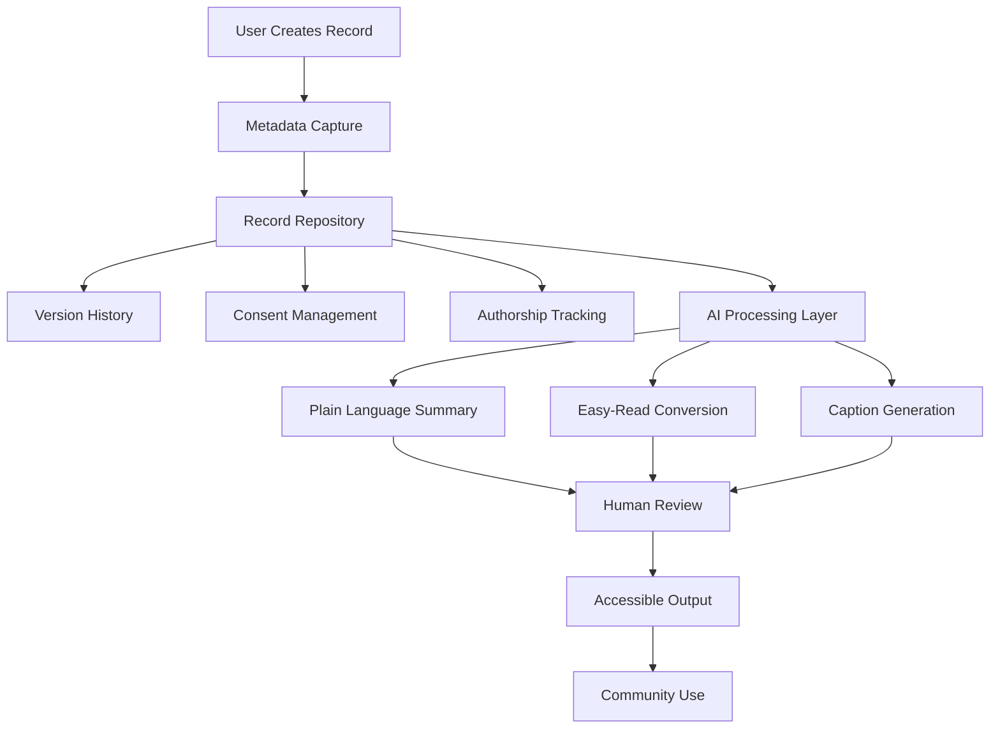

# Metadata Sovereignty AI Research Repository

Research repository supporting the **Metadata Sovereignty Alliance (EduLinked Pty Ltd)** project exploring ethical AI, authorship tracking, and accessibility-first metadata systems.

This repository is used by a student consulting team to investigate how artificial intelligence can responsibly support systems that preserve **authorship, consent, provenance, and accessible communication**.

Organisation: EduLinked Pty Ltd  
Location: Brisbane, Australia  
Contact: founder@edulinked.com.au  
Website: https://www.edulinked.com.au

## Start Here

New contributors should begin with these canonical orientation files:

- [NAVIGATION.md](NAVIGATION.md) - repository map and folder-level guide
- [STUDENT_RESEARCH_GUIDE.md](STUDENT_RESEARCH_GUIDE.md) - project context, research expectations, and contribution guidance
- [RESEARCH_QUESTIONS.md](RESEARCH_QUESTIONS.md) - research areas, outputs, and target folders
- [GLOSSARY.md](GLOSSARY.md) - shared terminology for metadata sovereignty, AI transparency, accessibility, and governance
- [METADATA_TEMPLATE.md](METADATA_TEMPLATE.md) - standard record documentation structure for authorship, provenance, consent, and AI processing permissions

Use these files as the source of truth before adding or revising research content.

## Project Overview

The Metadata Sovereignty Alliance explores how metadata-first infrastructure can protect authorship and ethical record governance in AI-supported systems.

Key themes include:

- authorship preservation
- accessible information formats, including Easy-Read and AAC
- transparent AI use
- ethical data governance
- consent and provenance tracking
- long-term systems memory

The project investigates **how AI can support these goals while maintaining strong ethical safeguards**. The intended pattern is human-led, metadata-first, and accessibility-aware.

## System Architecture Overview

The project explores a metadata-first architecture where records are governed by authorship, consent, and provenance before any AI tools are applied.

See [07_diagrams/system_architecture.md](07_diagrams/system_architecture.md) for a detailed explanation of the architecture.

## Repository Structure

| Path | Purpose |
| --- | --- |
| `01_project_brief/` | Project assignment context and background |
| `02_background_research/` | Literature review, sector analysis, and accessibility resources |
| `03_metadata-standards/` | Authorship tracking, provenance standards, and minimum metadata requirements |
| `04_accessibility-ai-features/` | Accessibility-focused AI research and transparency requirements |
| `05_ethics-framework/` | Responsible AI governance analysis, checklists, and evaluation metrics |
| `06_strategy-recommendations/` | AI strategy drafts, roadmap proposals, and implementation recommendations |
| `07_diagrams/` | Conceptual system architecture diagrams |
| `final-report/` | Draft and final report materials |

## Documentation Standards

When adding research outputs, contributors should:

- use the shared terms in [GLOSSARY.md](GLOSSARY.md) consistently
- document authorship, creation date, sources, and major revisions
- apply [METADATA_TEMPLATE.md](METADATA_TEMPLATE.md) when analysing records, examples, or case studies
- cite credible sources rather than relying only on promotional material
- make accessibility, consent, human review, and AI transparency visible in recommendations

Accessibility research resources are located in [`02_background_research/accessibility/`](02_background_research/accessibility/).
