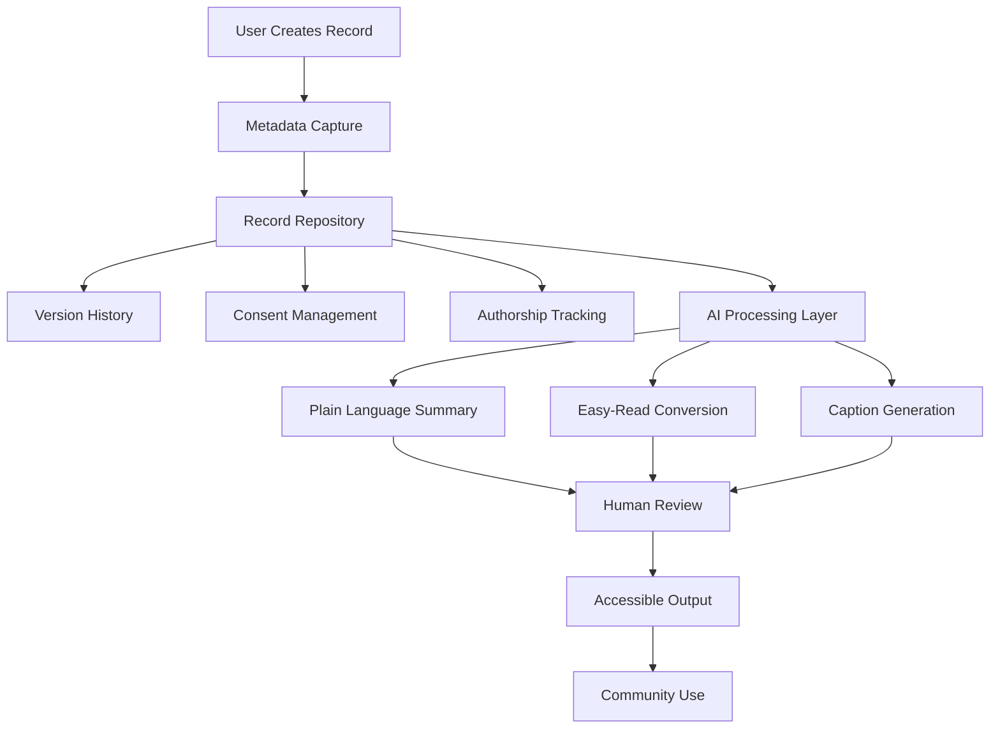

# Metadata Sovereignty AI Research Repository

Research repository supporting the **Metadata Sovereignty Alliance (EduLinked Pty Ltd)** project exploring ethical AI, authorship tracking, and accessibility-first metadata systems.

This repository is used by a student consulting team to investigate how artificial intelligence can responsibly support systems that preserve **authorship, consent, provenance, and accessible communication**.

Organisation: EduLinked Pty Ltd  
Location: Brisbane, Australia  
Contact: founder@edulinked.com.au  
Website: https://www.edulinked.com.au

## Start Here

New contributors should begin with these canonical orientation files:

- [NAVIGATION.md](NAVIGATION.md) - repository map and folder-level guide
- [STUDENT_RESEARCH_GUIDE.md](STUDENT_RESEARCH_GUIDE.md) - project context, research expectations, and contribution guidance
- [RESEARCH_QUESTIONS.md](RESEARCH_QUESTIONS.md) - research areas, outputs, and target folders
- [GLOSSARY.md](GLOSSARY.md) - shared terminology for metadata sovereignty, AI transparency, accessibility, and governance
- [METADATA_TEMPLATE.md](METADATA_TEMPLATE.md) - human-readable record documentation guidance
- [Machine-Operable Research System](docs/MACHINE_OPERABLE_RESEARCH_SYSTEM.md) - versioned contract, validator, authority boundaries, and implementation lifecycle

Use these files as the source of truth before adding or revising research content.

## Project Overview

The Metadata Sovereignty Alliance explores how metadata-first infrastructure can protect authorship and ethical record governance in AI-supported systems.

Key themes include:

- authorship preservation
- accessible information formats, including Easy-Read and AAC
- transparent AI use
- ethical data governance
- consent and provenance tracking
- long-term systems memory

The project investigates **how AI can support these goals while maintaining strong ethical safeguards**. The intended pattern is human-led, metadata-first, and accessibility-aware.

## Operational Baseline

The repository now includes a version 0.1 machine-operable metadata sovereignty contract. Research records can declare authorship, provenance, consent, accessibility, AI permissions, human review, publication authority, and integrity in structured JSON.

```bash
python scripts/validate_metadata_sovereignty_records.py examples/research-record.valid.json
```

The validator fails closed when required governance fields are absent or when declarations conflict—for example, when withdrawn consent is paired with publication approval or mandatory human review is incomplete.

Passing validation confirms contract completeness and internal consistency. It does not replace evidence appraisal, consent verification, accessibility audit, authorised human review, or publication approval.

## System Architecture Overview

The project explores a metadata-first architecture where records are governed by authorship, consent, and provenance before any AI tools are applied.



See [07_diagrams/system_architecture.md](07_diagrams/system_architecture.md) for a detailed explanation of the architecture.

## Repository Structure

| Path | Purpose |
| --- | --- |
| `01_project_brief/` | Project assignment context and background |
| `02_background_research/` | Literature review, sector analysis, and accessibility resources |
| `03_metadata-standards/` | Authorship tracking, provenance standards, and minimum metadata requirements |
| `04_accessibility-ai-features/` | Accessibility-focused AI research and transparency requirements |
| `05_ethics-framework/` | Responsible AI governance analysis, checklists, and evaluation metrics |
| `06_strategy-recommendations/` | AI strategy drafts, roadmap proposals, and implementation recommendations |
| `07_diagrams/` | Conceptual system architecture diagrams |
| `schemas/` | Versioned machine-readable governance contracts |
| `examples/` | Valid reference records for implementation and testing |
| `scripts/` | Deterministic local validation tools |
| `docs/` | Operational architecture and implementation guidance |
| `final-report/` | Draft and final report materials |

## Documentation Standards

When adding research outputs, contributors should:

- use the shared terms in [GLOSSARY.md](GLOSSARY.md) consistently
- document authorship, creation date, sources, and major revisions
- apply [METADATA_TEMPLATE.md](METADATA_TEMPLATE.md) when analysing records, examples, or case studies
- create a machine-readable record when the artefact enters a governed workflow
- cite credible sources rather than relying only on promotional material
- make accessibility, consent, human review, publication authority, and AI permissions explicit
- treat missing permission as no permission

Accessibility research resources are located in [`02_background_research/accessibility/`](02_background_research/accessibility/).
