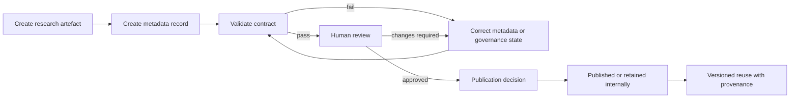

# Machine-Operable Metadata Sovereignty Research System

## Status

Version 0.1 is an implementation baseline, not a final standard. It converts the repository's existing human-readable metadata expectations into a machine-checkable contract while preserving human publication authority.

## Purpose

The system ensures that research artefacts carry structured governance information that software can inspect before using, transforming, or publishing them.

Every governed record must make these dimensions explicit:

- identity and record type
- authorship and organisational responsibility
- provenance and derivation history
- consent status and permitted scope
- accessibility status and available formats
- AI processing permissions
- human-review requirements and outcome
- publication status and authority
- version and integrity state
- evidence and governance context where applicable

## Components

| Component | Path | Function |
| --- | --- | --- |
| Contract | `schemas/metadata-sovereignty-research-record.schema.json` | Normative JSON Schema for version 0.1 records |
| Example | `examples/research-record.valid.json` | Valid reference record |
| Validator | `scripts/validate_metadata_sovereignty_records.py` | Deterministic policy and completeness checks |
| CI gate | `.github/workflows/validate-metadata-sovereignty.yml` | Runs validation when governed files change |
| Human template | `METADATA_TEMPLATE.md` | Contributor-facing explanation and capture guide |

## Lifecycle



## Machine-Operable Rules

The version 0.1 validator enforces cross-field rules that JSON structure alone cannot safely express in a simple contributor workflow:

1. Withdrawn consent cannot coexist with an approved or published record.
2. Records requiring human review cannot be approved or published until review status is `approved`.
3. Records with publication authority `not_authorised` cannot be approved or published.
4. AI permissions must be explicit booleans; silence is not permission.
5. Every record must carry at least one provenance source reference.
6. A reported content-hash mismatch is a validation failure.

## Accessibility authority binding

The version 0.1 `accessibility` object is a research-record declaration only. Its `status`, `formats` and optional `wcag_target` fields do not create a second accessibility model and do not establish that an artefact is accessible in real use.

Where an accessibility transformation, derivative or stronger accessibility claim is proposed, reuse the existing EduLinked authority chain by reference:

- `EduLinked-Pty-Ltd/core-machine-objects/objects/education/easy-read-adaptive-instructional-composition-v0.1.json` — Easy Read semantic and composition authority.
- `EduLinked-Pty-Ltd/core-machine-objects/objects/accessibility-capability-layer/contracts/accessible-document-lifecycle-v1.json` — source-preserving access requirement, transformation, automated check, human/AT verification, export and participation-outcome lifecycle.
- `EduLinked-Systems/edulinked-accessibility-system/adapters/easy-read/entrypoints.yaml` — current Easy Read implementation/navigation projection.
- `EduLinked-Pty-Ltd/accessible-RTO/templates/inclusive-learning-production-standard.md` (`AccessFlow v1.2.0`) — inclusive learning-production requirements, including multilingual/localisation, signed language, Easy Read, AAC, captions/transcripts and runtime accessibility.

`EduLinked-Systems/easy-read` remains production-gated while its source-owned authority-proof issue is open. Do not promote it to a production dependency from this research system.

The research system therefore preserves the following boundaries:

- `RESEARCH_RECORD_ACCESSIBILITY_FIELD != ACCESSIBILITY_REQUIREMENT`
- `FORMAT_DECLARED != FORMAT_PRODUCED`
- `FORMAT_PRODUCED != ACCESSIBILITY_VERIFIED`
- `AUTOMATED_CHECK != ACCESSIBILITY_CONFORMANCE`
- `PLAIN_LANGUAGE != EASY_READ`
- `EMOJI_OR_IMAGE != AAC`
- `TRANSLATED_TEXT != CULTURALLY_LOCALISED`
- `ACCESSIBILITY_OPTION_AVAILABLE != PARTICIPANT_PREFERENCE`
- `ACCESSIBILITY_VERIFICATION != PARTICIPATION_OUTCOME`

If future contract evolution needs evidence references for accessibility, it should bind the existing Core accessibility lifecycle object kinds and source-owned evidence by reference rather than inventing a repository-local receipt taxonomy or evidence store.

## Authority Boundary

Passing validation means only that the declared record is structurally complete and internally consistent with version 0.1 rules. It does **not** prove that:

- a research claim is true;
- consent evidence is authentic;
- accessibility has been independently audited;
- a reviewer is appropriately authorised;
- publication has been approved outside the record; or
- the artefact is suitable for unrestricted AI training or commercial reuse.

Human and organisational authority remain required wherever declared by the record and applicable policy.

## Adding a Governed Record

1. Copy `examples/research-record.valid.json` to an appropriate records directory.
2. Assign a stable `msr:` identifier.
3. Replace all example values with evidence-based declarations.
4. Keep AI permissions explicit and conservative.
5. If an accessibility transformation or claim is in scope, reference the applicable source-owned accessibility requirement/evidence rather than converting the local `formats` field into proof.
6. Run:

```bash
python scripts/validate_metadata_sovereignty_records.py path/to/record.json
```

7. Submit the artefact and metadata record together for review.

## Planned Evolution

Future versions should prioritise composition with existing authorities rather than creating parallel registries or evidence systems. Candidate evolution includes:

- stronger references to existing governed identifiers where source systems already own them;
- cryptographic content hashing;
- source-owned reviewer/authority references rather than a repository-local authority registry;
- citation-resolution and evidence-link validation;
- JSON-LD context and knowledge-graph mappings where these preserve source authority;
- bindings to the existing Core accessible-document lifecycle for accessibility requirement, transformation, verification and participation evidence;
- consent event history composed with applicable source-owned consent/permission semantics rather than only current status;
- migration rules between contract versions; and
- compatibility mapping to W3C PROV, DataCite, Dublin Core, SPDX, ORCID, Schema.org and relevant accessibility standards.

Any normative schema expansion, controlled-vocabulary change, publication-policy change or authority-model change remains human-review gated.
